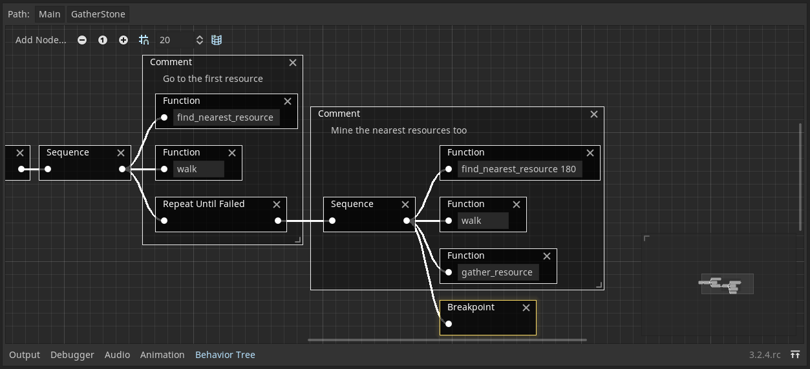

# Behavior Tree Plugin

This plugin allows you to create complex AI behaviors using a tree of nodes.
It uses a `GraphEdit` to edit the tree instead of the common Node-based approach, making it easier to use and better integrated into Godot.

To learn about behaviour trees, check out this Gamasutra article by Chris Simpson: [Behavior trees for AI: How they work](https://www.gamasutra.com/blogs/ChrisSimpson/20140717/221339/Behavior_trees_for_AI_How_they_work.php)

## Usage

To add a behavior tree to a node, enable the plugin and add a `BehaviourTreePlayer`. An editor similar to the visual shader editor will show up in the bottom panel where you can edit the behavior tree.

## Nodes

### Misc

|Node|Description|
|-|-|
|Root|Used for cosmetic reasons. Executes the next node.|
|Group|Executes a group graph. See `Groups`|
|Comment|Editable comment. Click the text to edit it. Stripped from the graph before execution.|

### Composites

Composites execute a variable amount of branches in different ways. The order of execution is calculated by the position of the nodes. They are executed from top to bottom.

|Node|Description|
|-|-|
|Selector|Executes until one branch succeeds. Returns failed if none succeeded, and success otherwise.|
|Sequence|Executes until one branch fails. Returns failed if one failed, and success otherwise.|
|Randomizer|Simmilar to sequence, but in random order.|

### Decorators

Decorators modify the execution of the next node in different ways.

|Node|Description|
|-|-|
|Inverter|Inverts the output of the next node.|
|Repeater|Repeats the previous node infinitly, or the number of times put in the property field.|
|Repeat Until Failed|Repeats the next node until it fails.|
|Repeat Until Succeeded|Repeats the next node until it succeeds.|
|Succeeder|Executes the next node, but always succeeds.|
|Failer|Executes the next node, but always fails.|

### Leafs

Leafs are the final nodes. They have different functionality.

|Node|Description|
|-|-|
|Condition|Succeeds if the given expression is true. It is executed in the context of the root node.|
|Function|Executes a function of the root node and uses its return value as status.|
|Expression|Executes an expression in the context of the root node. Always succeeds.|
|Wait|Waits the given amount of seconds.|
|Breakpoint|Halts execution if hit.|

## Groups

Groups are ways to organize and reuse node arrangements.

To create a group, add a `Group` node and enter the group name. To edit the group, click the `Edit` button of the `Group` node. The graph of the group will be opened in the editor. A `Root` will be generated when opening a graph for the first time.

To rename the group, just change the name in the `Group` node.

To go back to the previous graph, use the `Path` section above the graph editor. Groups can be used globaly and can be nested.
